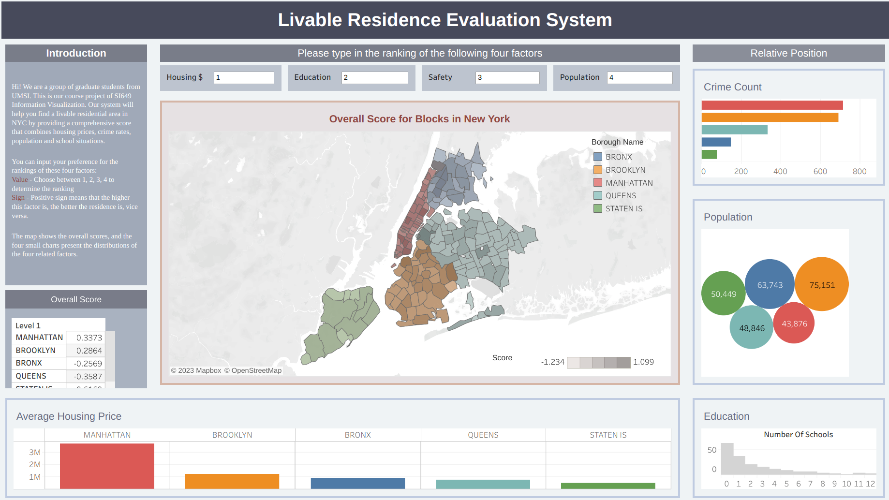

    

For people who want to live in New York City, finding a suitable neighborhood is always one of the biggest concerns. However, considering the difference in people's preference, it is hard to come up with a uniform metric to rank the neighborhoods. Thus, this project come up with a livable residence evaluation system that can customize the metric by assigning different weights to various factors including: education, population, safety, housing price. Users can interact with the dashboard to see which neighborhoods they like based on there own preference.

<a href="https://lr-evalsystem.github.io/">Access the dashboard here</a>

To conclude what we have done in this project:

1. We come up with a weighted sum method that takes different factors into consideration when evaluating the livability of certain neighborhood. We then make it user-customized so that users can adjust the weight by their own preference.
2. Based on our metric, we build a Tableau dashboard that interactively show the scores. The data visualization is straightforward, with supplementary plots showing the distribution of the scores.

We hope our dashboard can help those people who want to settle down in the New York City to choose a place to live in.
