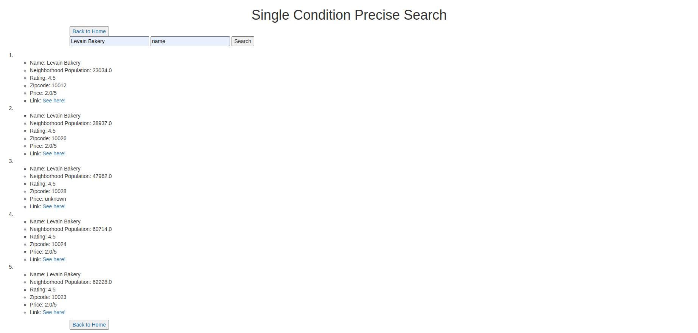
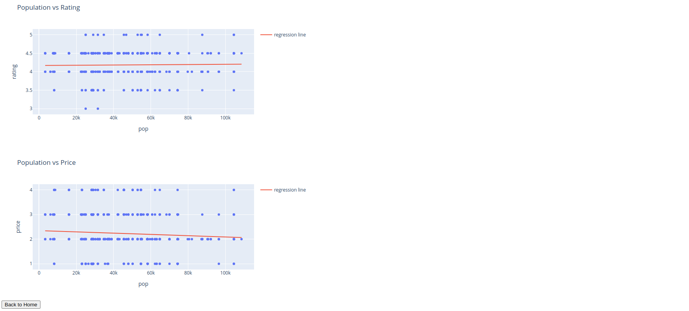

Finding restaurant for dinner is always a commonly seen scenario in our daily lives. There are lots of popular applications that enable us to search restaurants on-line together with its rank and comments. In this project, a toy application is built using the [Yelp API](https://docs.developer.yelp.com/). It records 1000 restaurants in the New York City area, and use a KD-tree to store the data, which enables efficient storing and searching. Also, a simple user interface is constructed using `Flask` to enable user to perform four different actions:

1. View Restaurants in an Interactive Map
2. Perform a Single Dimension Precise Search
3. Perform a Range Search
4. See the relation between Population and Restaurant Price and Rating

##### View Restaurant in an Interactive Map

In this screen shot, we can see that user can easily get the information for all the restaurants stored in the data set for this project by hovering the mouse on the corresponding point. Also, this map supports zooming into a part of the map. With the help of the map, user can easily find the restaurants in a certain area, as well as their ratings. This can help them make plans for their lunch or dinner. 

##### Conduct a Single Condition Precise Search

In this page, user can conduct a single dimension precise search, which means that user need to put exactly the name `key-dimension` pair to find all the related records. As shown in the picture above, after entering the searching condition, all the related records are shown in a list.

##### Conduct a Range Search

In this page, user can conduct a range search. A range search means that user can enter a range and the search engine will return all the records that fall in that range. In this page, user can enter ranges for `population`, `rating`, `price`, and `name (sort by ASCII)` to search. For each of the dimension, a maximum and minimum value is required. If they are left blank, the default values will be filled in (0 and `math.inf` respective) to ensure all the possibly useful records are selected.

##### Relations between Neighborhood Population and Restaurant Price and Rating

This page uses two interactive line plot to demonstrate the relation between Neighborhood Population and Restaurant Price and Rating. From the pictures, we can conclude that the neighborhoods with more population tend to have lower price and higher rating. But this effect is not that significant.

##### Interactive Techniques Used

`Flask` and `Plotly` are used to construct the web and interactive plots respectively.

##### Demo Link

https://drive.google.com/file/d/1tE9Hm8zJ5kSl6AhtgW5kEJqyq9C9HD0H/view?usp=sharing
