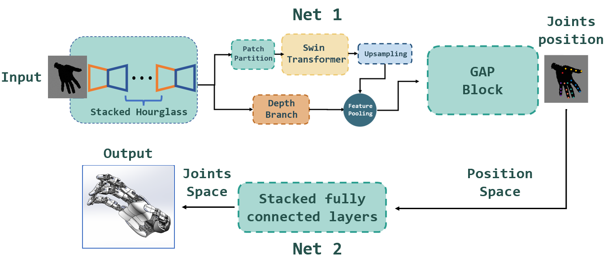

Hand Pose Estimation has drawn people’s attention in recent years. Significant progresses have been made in this field with various of solutions provided by researches. Meanwhile, the development of robotics require robots to perform human-like behaviors precisely. In this paper, we proposed Sakura Net, which is a Deep Convolutional Neural Network inspired by existing TriHorn-Net. Several prevalent components including three-branch bottle-neck structure and Swin Transformer are used in our net-work in order to improve the performance. We show that our network can estimate hand poses in a precise manner from a depth image. We also demonstrate that our model can map the estimated hand pose to simulated robot hands with relatively high accuracy. To be more specific, we show that our model improve the original TriHorn-Net by 8% under some training sets.

The report can be found [here](https://github.com/TaikiShuttle/ECE4880J/blob/main/project/Sakura_Final.pdf).
